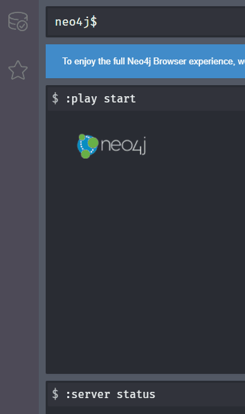

# Patient Safety Knowledge Graph

## Table of Contents:

1. [Project Description](#Project-Description)
2. [Getting Started](#Getting-Started)
3. [AIBench Setup](#AIBench-Setup)
4. [Prerequisites](#Prerequisites)
5. [PSKG Project Setup](#PSKG-Project-Setup)
6. [Configure S3 Staging Bucket](#Configure-S3-Staging-Bucket)
7. [Configure SageMaker Loader Notebook](#Configure-SageMaker-Loader-Notebook)
8. [Configure SageMaker Neo4J Database Notebook](#Configure-SageMaker-Neo4J-Database-Notebook)
9. [Build Neo4J Knowledge Graph Database](#Build-Neo4J-Knowledge-Graph-Database)
10. [Process Data and Create Load Files](#Process-Data-and-Create-Load-Files)
11. [Load SageMaker Neo4J Database (with newly created data](#Load-SageMaker-Neo4J-Database-(with-newly-created-data))
12. [Obtaining Up to Date PSKG Source Data from Data Providers](#Obtaining-Up-to-Date-PSKG-Source-Data-from-Data-Providers)
13. [CDC](#CDC)
14. [CombinedExpousre (AstraZeneca Vaxzevria)](#CombinedExpousre-(AstraZeneca-Vaxzevria))
15. [EudraVigilance](#EudraVigilance)
16. [VAERS](#VAERS)
17. [Executing PSKG with Up to Date Data](#Executing-PSKG-with-Up-to-Date-Data)

## Project Description

This project organizes, processes, stores, and facilitates analysis of real world vaccine safety data from multiple disparate global sources. These sources include CDC, VAERS, ECDC, EudraVigilance, MedDRA and other public sources.  These data are used for regulatory oversight, pharmacovigilance, and driving strategic decisions at all levels. Safety data for  COVID-19 vaccines in 2021 is four times larger than all other on-market product safety data, combined.  PSKG transforms these data into a unified vaccine safety graph data model. An automated data processing pipeline eliminates the consolidation bottleneck and allowing safety scientists to interact directly with a single source of truth. The graph can be easily integrated with BI tools and queried for specific analyses ranging from simple adverse event monitoring to more complex AI tasks, leading to faster and smarter data analysis solutions.

## Getting Started 
Currently PSKG is configured to run in AIBench (AWS) leveraging EC2 and SageMaker notebooks. 

### AIBench Setup 

#### Prerequisites 

 1. AWS AIBench Project 
 2. MedDRA Subscription
 3. Neo4J

PSKG runs in a Neo4j graph database and requires at least 16GB of memory (RAM), and ideally at least 4 CPU cores. These requirements may change based on the size of the data. The Neo4j instance runs within a Docker container built on the enterprise Neo4j image.

#### PSKG Project Setup  
 1. Create two S3 buckets; one for staging source data (read access) and the other for output (write access).
 2. Create a SageMaker Notebook with appropriate configuration; and a terminal on the associated EC2 instance for data loading, and a second run a Neo4J container instance.
 
##### Configure S3 Staging Bucket 
 3. Create the following key structure on the S3 staging bucket
        CDC
        CombinedExpousre
        EudraVigilance
        MedDRA/v24.0
        ref_data
        VAERS
        VAERS_Meta 
 4. Upload files from 2021_data directory to corresponding directories in S3 Staging instance.
 5. Download MedDRA Version 24.0 and upload to `MedDRA/v24.0`. Please note MedDRA subscription is required for this action. 
 
##### Configure SageMaker Loader Notebook 
 5. Login into Loader Notebook instance 
 6. Start bash:
    * `bash` 
    * `cd ~/SageMaker` 
 7. Clone this repository and checkout the master branch.
 8. Update S3 Location variable in config.yml located in ~/SageMaker/patientsafetykg/pskg folder as follows:
     S3_Locations:
          S3_INPUT_BUCKET: <S3 Staging Bucket Amazon Resource Name (ARN)> 
          S3_OUTPUT_BUCKET:<S3 Output Bucket Amazon Resource Name (ARN)> 
 9. Update  EV_SOURCE variable in config.yml from 'Public' to 'EVDAS', if using EudraVigilance AE line listing report from EVDAS system instead of the provided publicly available sample data
 
          
##### Configure SageMaker Neo4J Database Notebook 
 10. Login into Neo4J Database Notebook instance
 11. Start bash:
    * `bash` 
    * `cd ~/SageMaker` 
 12. Clone this repository and checkout the master branch. 
 13. Change directory to root folder 
     * `cd ~/SageMaker/patientsafetykg`
 14. From the project root folder (~/SageMaker/patientsafetykg) execute:
     * `. neo4j/docker/run.sh`  - download and build the official neo4j docker image, start the container. 
     
     Note: To configure for Neo4j Enterprise, modify the line starting with *neo4j:* in the  `. neo4j/docker/run.sh`
 
### Build Neo4J Knowledge Graph Database 
#### *Process Data and Create Load Files* 
 1. Login to SageMaker Loader notebook 
 2. `cd SageMaker/patientsafetykg`
 3. Start bash shell by executing `bash` command 
 4. Activate patientsafetysandbox environment by executing command:
     * `conda activate patientsafetysandbox`  
 5. Run pipeline script (example shown).  It is important to use the nohup command to ensure that script runs even if the terminal session gets interrupted.  
    * `nohup python ./build_pskg_graph.py --az_exposure 2021-12-31  -- eudravigilance 31Dec2021 --quite --output_data_version --20211231Data` 
***Please note:***
* The date parameters indicate the cutoff date representing as of date of the source data. The files are saved with appending cutoff date to the names of the EudraVigilance files as 'fname_ddMONyyy'.xlsx and prepending to the combined exposure files as 'YYYY-MM-DD-CombinedExposure.xlsx' Multiple EudraVigilance files can be loaded having the same cutoff date appended to the name. 
* output_data_version is the name of the folder that will be created to store processed files on S3. The name given in the above example is '20211231Data', it could be any descriptive name to identify the version of load files. 
* This may take from 4 to 6 hours to complete. 
 6. The build_pskg_graph.py script uses Python logging, log files rotate and are located in the logs directory. Use the tail command (or any pager like “less”) to view the log: execute:
     * `tail -f ../Logs/pskg_import_log.log`
 7. Confirm the load process completed successfully by reviewing the log file.
 
#### *Load Neo4J Database (with newly created data)* 
 1. Login to AIBench (AWS) and launch a Jupyter workspace 
 2. `cd SageMaker/pateintsaftykg/pskg`
 3. Create two Terminal sessions (EC2, DC) if not already present. Two bash command terminals are needed: 1 for issuing commands on the EC2 instance (EC2), 1 for commands to the docker container (DC).
 4. Start bash shell on both Terminals: `bash`
 5. On the Terminal (DC), execute the following commands: 
    * `docker container exec -it pskg /bin/bash` - start docker session
    * `cd /var/lib/neo4j/import`
    * `rm /var/lib/neo4j/import` - clear contents of the import folder 
 6. Switch to second Terminal (EC2) and execute the following commands
    * `cd ~/SageMaker/patientsafetysandbox/`
    * `rm data/*` - clear contents of the “data” folder (you can create this folder if it does not exist)` 
    * `aws s3 cp --recursive s3:"ARN"/box_archive/20211231Data data` where "ARN: is Amazon Resource Name for Staging S3 bucket. The command copies files to the “data” folder from the he S3 bucket in which the load files were saved. 
    * Confirm all files are successfully copied to the SageMaker/patientsafetysandbox/data folder.
    * Now copy the files from the data folder to docker container by executing refresh_data.sh scripts: `./neo4j/docker/refresh_data.sh data`
 7. Switch back to the other Terminal (DC)
     * Confirm the current directory is /var/lib/neo4j/import
     * Confirm the files you expect are now present in the import folder: `ls -l`
     * Confirm container is running: `docker container ls –all`
     * if you are running enterprise container, you may want to create your own database in Neo4j be executing the command: `cypher-shell -u neo4j -p pskg 'create database `20211231PS`'` - You can choose any name for the database. Please note, you will need to drop and recreate the database if previously existed. In Neo4j developer edition, you will not be a able to create a database. Instead, it will only have a single database called neo4j. 
     * For developer edition, execute load script to populate the database using the load files in import folder: `cypher-shell -u neo4j -p pskg -f load.cypher`
     * For enterprise container, execute load script to populate the database you created: `cypher-shell -u neo4j -p pskg -f load.cypher -d 20211231PS`    
     * Run the Jupyter Notebook `PSKG Validation Tests.jpynb` to verify the data in 20211231PS database (neo4j, if public container)
     * Once the database is built you may interact with it via the different available Neo4j packages and interfaces or run Cypher queries directly from the Neo4j Browser. To open the browser, navigate to `http://localhost:7474/browser/` on your web browser. Opening up the Database tab on the left hand side of the browser window will display all current nodes, edges and attributes in the graph.

## Obtaining Up to Date PSKG Source Data from Data Providers 

**PSKG data refresh is not incremental and needs to be completely rebuilt.**

### CDC 

**CDC Data.gov API access** 
 1. https://data.cdc.gov/login -- create an account with email/pw using “Sign Up” link. 
 2. Update the following variable in the `CDC Exposure API.jpynb' with the CDC credentials 
    * `CDC_ADMIN_DATA = `
    * `CDC_APP_KEY = `
 3. Execute `CDC Exposure API.jpynb' in Jupyter lab 
 4. Upload the output file `AnalysisOutput/CovidVaccineAdmin_API.csv` to the S3 Staging bucket in CDC folder
 
### CombinedExpousre (AstraZeneca Vaxzevria) 

This file is compiled from multiple sources to obtain exposure by country. Up to date Vaxzevria exposure data source for each country can be found in the *InformationSource column of the 2021-12-31-CombinedExposure.xlsx* file. The file can be updated by inserting new rows with the new exposure information and Date Reported. Once the file is updated, it can be uploaded to CombinedExposure folder in the S3 Staging bucket.

### EudraVigilance 

EVDAS subscription is required to download EudraVigilance file(s). EVDAS access can be obtained with MedDRA subscription. There is a limitation on the size of file that can be downloaded from EVDAS. Therefore, the data may need to be downloaded into multiple files. 
 1. Download line listings files of all AESIs from EVDAS and append the cutoff date to each downloaded file. For example, *COVID-19 MRNA VACCINE (NUCLEOSIDE-MODIFIED)_Line listing_31Dec2021.xlsx*. In this example 31Dec2021 is the appended cutoff date. PSKG code will identify files with the cutoff date and process those having the cutoff date provided as parameter in the load script.
 
Note: PSKG can be configured in config.yml to work with EudraVigilance public or subscribed AE line listing data. The  sample data included with this code is from the public site: * https://dap.ema.europa.eu/analytics/saw.dll?PortalPages (Line Listing Tab). This data does not include 'Worldwide Global Identifier' which is available in subscription data. In the sample data 'EU Local ID' is used as a case identifier. Additionally, the Case count may slightly differ between the two data sources. 

### VAERS 

Up to date VAERS data can be obtained from `https://vaers.hhs.gov/data/datasets.html` 

1. Download 2022 zip file 
2. Download 2021 zip file
3. Download NonDomestic file
4. Transfer to VAERS folder in S3 Staging bucket 

## Executing PSKG with Up to Date Data 
Once the data files are updated, follow the same instructions provided in the [Build Neo4J Knowledge Graph Database](#Build-Neo4J-Knowledge-Graph-Database)
 
 

    
 

